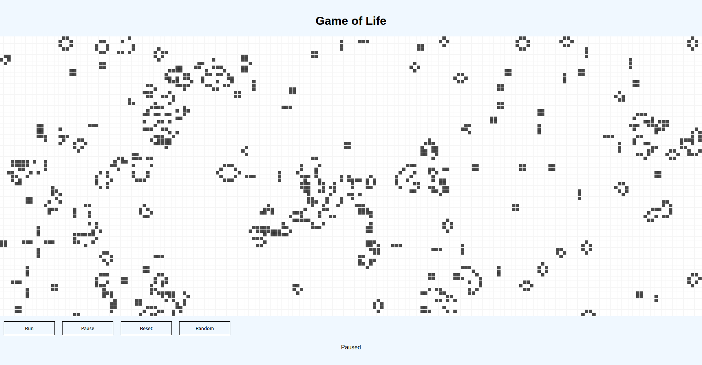

# Game of Life

<div align="center">
    
</div>

This project is an implementation of Conway's **Game of Life**, a cellular automaton simulation. <br />
The game runs in a browser using the **Phaser** game framework and React for the UI.

## How to Run

1. Clone the repository

2. Install dependencies:
```bash
npm install
```

3. Start the development server:
```bash
npm start
```

4. Open your browser and navigate to [http://localhost:3000](http://localhost:3000)


## Controls
- Run: Starts the simulation.
- Pause: Pauses the simulation.
- Reset: Clears the grid.
- Random: Fills the grid with a random pattern.
- Click on Cells: Toggle individual cells between alive and dead.

## Technologies Used
- React: For the UI and component structure.
- Phaser: For rendering the game grid and handling game logic.
- TypeScript: For type safety and better development experience.
- CSS: For styling the application.

